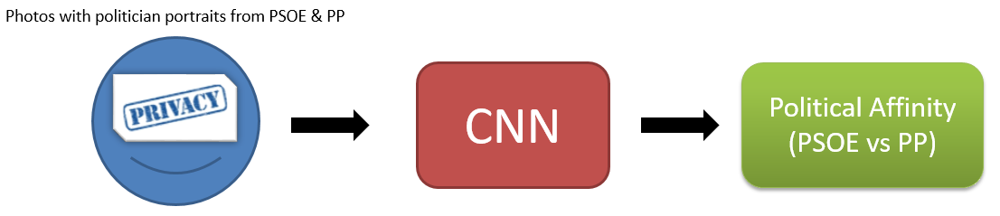

# Deep Politics
Prediction of Spanish Political Affinity with Deep Neural Nets: Socialist vs People's Party (PSOE vs PP)

**Note: This project is just an academic intent to understand the human face characteristics for social studies. It is NOT an intent to invade the personal privacy! There is no public database or model to be used for predictions. The model is based on a very small number of cases and, therefore, it is not good enough for accurate applications.**

### Run the project (online)

You can run the jupyter notebooks online and free with mybinder: https://mybinder.org/v2/gh/muntisa/Deep-Politics.

### Task to solve

Do you think that the political affinity could be read from our face, just using a portrait photo?

### Why

I know only few Spanish politicians. But watching Spanish TV, I started to guess the political party of people. So, I was thinking: if my brain can predict with enough accuracy the political party by looking to people face, let’s try the same, but using an artificial mini-brain: a Deep Neural Network.

### Method

* Database = crops from politician's photos from Google Search: 50 random photos for PSOE + 50 random photos for PP  + *data augmentation*.
* Network topology: small Convolutional Neural Networks (CNNs) or pre-trained VGG16.
* Tools: Keras, Tensorflow, jupyter notebooks.
* Hardware: desktop Win 10, Intel i7, 16 G RAM, GPU Nvidia Titan Xp.
* Input image dimensions: 150 x 150 pixels.
* Sets: 80 phoos for training, 20 photos for testing
* Output: PSOE or PP classes.

### Steps & Results

* [Spit_Dataset.ipynb](Spit_Dataset.ipynb): Split dataset in training and test subsets.
* [Small_CNNs.ipynb](Small_CNNs.ipynb): **Small CNNs** with Conv-Conv-Conv-FC (Conv = Convolutional block, FC = Fully-Connected layer), you can obtain an **accuracy over 80%** in few minutes.
* [TransferLearningVGG16.ipynb](TransferLearningVGG16.ipynb): **Transfer Learning** using a pre-trained VGG16 with the Imagenet weights: 100 photos without data augmentation, training only the FC layer =>> similar accuracy over 80%.
* [FineTuningVGG16.ipynb](FineTuningVGG16.ipynb): **Fine Tuning** of a pre-trained VGG16 with the Imagenet weights: training of 2 last Conv block of VGG16 + FC, you can obtain test **accuracy of 85%**!

### Acknowledgements
I gratefully acknowledge the support of NVIDIA Corporation with the donation of the Titan Xp GPU used for this research (https://developer.nvidia.com/academic_gpu_seeding). The entire project was done at RNASA-IMEDIR group, Computer Science Faculty, University of A Coruna, Spain.
